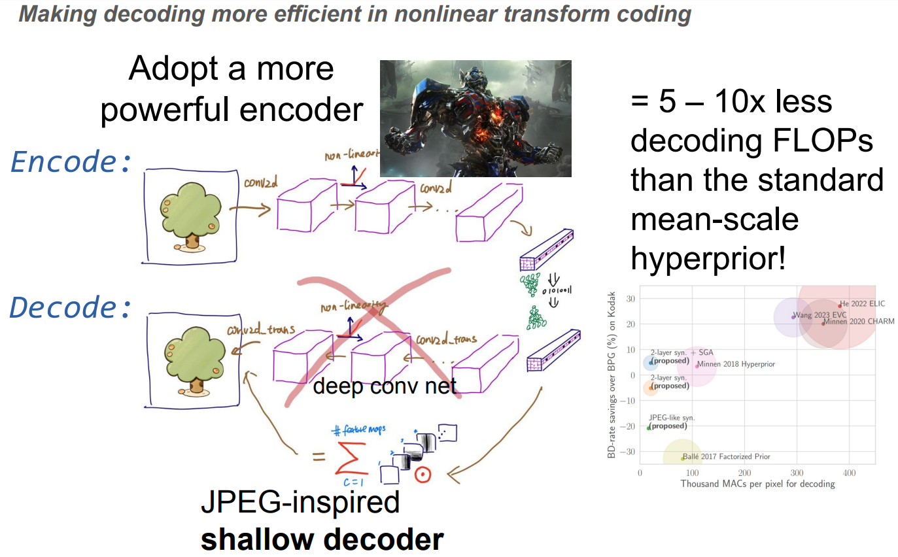

# About

This repo contains the source code and results in the ICCV 2023 paper
[Computationally-Efficient Neural Image Compression with Shallow Decoders](https://arxiv.org/pdf/2304.06244.pdf)
(formerly titled "Asymmetrically-powered Neural Image Compression with Shallow Decoders").



As far as we know, this is the first neural image compression method to operate with a decoding
budget of less than 50K FLOPs/pixel while achieving rate-distortion performance competitive with
BPG, when measured in PSNR and BPP.

**UPDATE [Nov 1, 2023]** Added pretrained checkpoints; download them [here](https://huggingface.co/yiboyang/shallow-ntc-checkpoints/).
See [`notebooks/vis_syn_filters.ipynb`](notebooks/vis_syn_filters.ipynb) for an example for how to load a model and visualize
the learned filters of the synthesis transform.


# Software

- The code was developed in a python 3.10 environment on Linux.
  The main dependices are tensorflow 2.10
  and [tensorflow-compression 2.10](https://github.com/tensorflow/compression/releases/tag/v2.10.0),
  which can be installed by
  `pip install tensorflow-compression==2.10.0` (we recommend doing so in a new conda environment).
- The code has been written to separate the training/evaluation/iterative inference logic from
  the model architecture, and makes it easy to run hyperparameter sweep with
  Slurm (optional, but recommended).
- At the highest level, model architectures are distinguished by the type of entropy model/prior
  they use. For a given choice of entropy model, one is free to plug in different kinds of
  transforms (collected in `common/transforms.py`) and experiment with different hyperparameters
  (defined in `configs` subdirectory of each model directory). The code currently
  supports the following entropy models:
    - Factorized prior (Ballé et al. 2017): [`./factorized`](./factorized)
    - Mean-scale hyperprior (Minnen et al. 2018): [`./mshyper`](./mshyper)
- There is some basic support for timing the transforms in graph mode, but can be inaccurate
  because of occasional JIT compilation slowdowns.

# Setup

- Update the overall project configuration in [`configs.py`](configs.py) according to your system and location of your data. You can find
  instructions for obtaining coco, kodak, and tecnick data
  in https://github.com/mandt-lab/RD-sandwich#data-preparation
- To use Slurm, create a directory called './slurm_jobs', and modify `slurm_template.py`
  to perform your own software setup (e.g., load cuda, activate conda environment, etc.).

# Training

Here's an example command to train a factorized prior model, with settings defined in a config
file (run from the project root dir):

```
python -m factorized.train --config factorized/configs/bls2017.py --alsologtostderr
```

Here's another example for training the two-layer synthesis + ELIC analysis model:

```
python -m mshyper.train --config mshyper/configs/two_layer_syn.py --alsologtostderr
```

Here's an example command to launch Slurm training jobs with a hyperparameter sweep defined in the
config file:

```
./launch.py --main factorized.train --config factorized/configs/bls2017.py
```

By default, the experiment output will be written to `project_dir/train_xms`.
Each experiment is identified by a unique id ("xid"; this is a
string of number assigned by Slurm or a timestamp when not running with Slurm); within each
experiment there can be multiple runs, each run
on a different work unit with its own integer id ("wid"; this is simply the integer index
of the
hyperparameter setting being used in the hyperparameter sweep (defined by `get_hyper` in the
config file)).
The output of each work unit will be stored in `project_dir/train_xms/xid/run_dir`, where
`run_dir` consists of a work unit id (like "wid=2") and a "runname" automatically generated from
the hyperparameter setting (e.g., "num_filters=256-lr=0.001").

The logs and intermediate reconstructions can be viewed on tensorboard (just run the
usual `tensorboard --logdir your_workdir` command).

Below is a list of model architectures from the paper and the corresponding "config" files for
training experiments:

| Model                                                                         | Config file                         |
|-------------------------------------------------------------------------------|-------------------------------------|
| Ballé et al. 2017                                                             | `factorized/configs/bls2017.py`     |
| Minnen et al. 2018 (mean-scale Hyperprior)                                    | <br/>`mshyper/configs/mbt2018.py`   |
| Proposed JPEG-like (one-layer) synthesis + ELIC analysis                      | `mshyper/configs/jpegl.py`          |
| Proposed two-layer synthesis + ELIC analysis                                  | `mshyper/configs/two_layer_syn.py`  |
| No-residual two-layer synthesis + CNN analysis + mixed quantization training* | `mshyper/configs/two_layer_syn2.py` |

*In additional experiments we found this combination to give further improved R-D performance
than the proposed two-layer synthesis + ELIC analysis.

Some pretrained checkpoints can be found [here](https://huggingface.co/yiboyang/shallow-ntc-checkpoints/).
See an example of working with a checkpoint [here](notebooks/vis_syn_filters.ipynb).

# Evaluation

Here's an example command to launch Slurm jobs for evaluating trained checkpoints, on a dataset
called $dataset_name:

```
./launch_eval.py --workdirs 'train_xms/188188/wid=*' --dataset $dataset_name
```

where `train_xms/188188/wid=*` is an example glob pattern that matches the workdirs of the runs to
be evaluated. The results will be written to `json_results/$dataset_name/end_to_end`.
Additional flags for `eval.py` can be passed to `launch_eval.py` via `--args` (e.g., controlling
where results are stored and whether to skip eval when there are existing result files).

# Iterative Inference

Here's an example command to launch Slurm jobs running iterative inference on pretrained
checkpoints that use the hyperprior entropy model (substitute `factorized` for `mshyper` for
models that use the factorized prior):

```
./launch.py --main mshyper.itinf --config mshyper/configs/itinf.py
```

This is basically the same as the train command; see details in the `mshyper/configs/itinf.py`
config file.

The results will be stored in `project_dir/itinf_xms/`, with a similar naming
convention/organization to the model training experiments.

You can find a demo of SGA [here](https://github.com/mandt-lab/improving-inference-for-neural-image-compression/tree/tf2).
